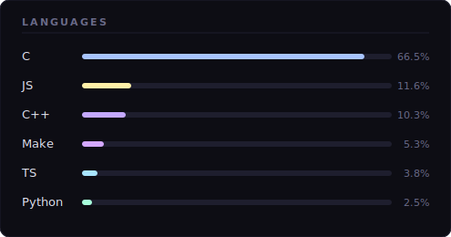

 

&nbsp;&nbsp;

&nbsp;&nbsp;

&nbsp;
&nbsp;
&nbsp;
&nbsp;
&nbsp;

## ▸ Skills

### 🖥️ Systems & Low-level

### 🧩 Object-Oriented Programming

### 🌐 Web & Full-stack

### ⚙️ DevOps & Infrastructure

---

## ▸ Languages

---

## ▸ Public Repos

<!--
*futur repo :*******************************************************************************************************************************************************************************************************

********************************************************************************************************************************************************************************************************************
-->

---

  

